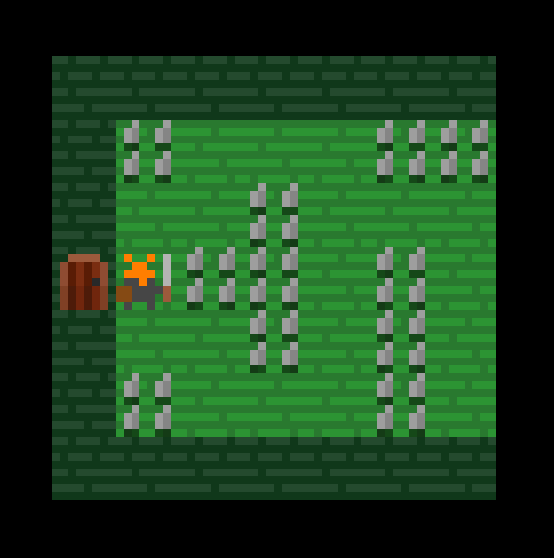

# JSRPG

RPG de navegador con tiles de 8×8, escrito en JS vanilla.



## Cómo correr

```bash
python server.py
```

Abre el preview en el puerto 5000.

## Controles

- **Flechas / WASD** — moverse
- **X** — atacar
- **F / clic** — interactuar (cofres, fuentes, puertas)
- **I** — inventario

## Editor de mapas

Solo disponible en el servidor local. Abrilo con la tecla **\`** (acento grave) o desde el menú de ajustes.

Funciones del editor:
- Editar tiles visuales y de colisión por separado
- Pincel o relleno tipo flood-fill
- Click derecho = cuentagotas
- Guardar cambios directo al disco

## Estructura

```
src/
  engine/     motore del juego
  maps/       mapas (CSV + definitions.jsonc)
  assets/     sprites, tiles, UI, sonidos
  editor/     editor de mapas (solo local)
  index.html  punto de entrada
server.py     servidor HTTP con API de escritura pa el editor
```
